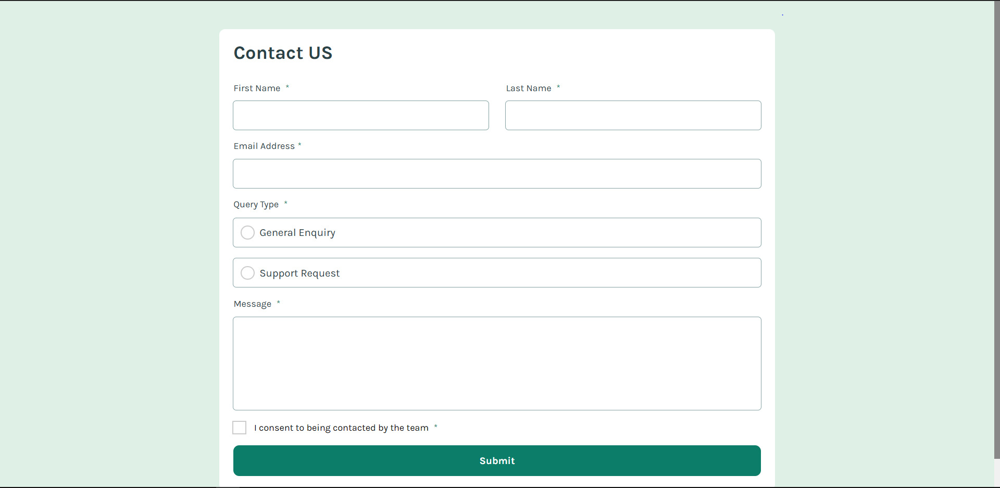

# Frontend Mentor - Contact Form Solution

This is a solution to the [Contact form challenge on Frontend Mentor](https://www.frontendmentor.io/challenges/contact-form--G-hYlqKJj). Frontend Mentor challenges help you improve your coding skills by building realistic projects.

## Table of Contents

- [Frontend Mentor - Contact Form Solution](#frontend-mentor---contact-form-solution)
  - [Table of Contents](#table-of-contents)
  - [Overview](#overview)
    - [The Challenge](#the-challenge)
    - [Screenshot](#screenshot)
    - [Links](#links)
  - [My Process](#my-process)
    - [Built With](#built-with)
    - [What I Learned](#what-i-learned)
    - [Continued Development](#continued-development)
    - [Useful Resources](#useful-resources)
  - [Author](#author)
  - [Acknowledgments](#acknowledgments)

## Overview

### The Challenge

Users should be able to:

- Complete the form and see a success toast message upon successful submission.
- Receive form validation messages if:
  - A required field has been missed.
  - The email address is not formatted correctly.
- Complete the form only using their keyboard.
- Have inputs, error messages, and the success message announced on their screen reader.
- View the optimal layout for the interface depending on their device's screen size.
- See hover and focus states for all interactive elements on the page.

### Screenshot



### Links

- Solution URL: [My Solution](https://github.com/yourusername/contact-form-solution)
- Live Site URL: [Live Demo](https://your-live-site-url.com)

## My Process

### Built With

- Semantic HTML5 markup
- CSS custom properties
- Flexbox
- Responsive Design
- JavaScript

### What I Learned

While working on this project, I gained more experience in:

- Creating accessible forms by adding proper `aria-*` attributes and `for` labels.
- Implementing custom hover and focus states for interactive elements.
- Using JavaScript to add custom behavior, like ensuring only one checkbox is selected at a time.
- Writing responsive styles to adjust layouts based on screen width.

Here’s an example of how I used JavaScript to manage single-selectable checkboxes:

```javascript
const checkboxes = document.querySelectorAll('.single-checkbox');

checkboxes.forEach(checkbox => {
    checkbox.addEventListener('change', () => {
        if (checkbox.checked) {
            checkboxes.forEach(cb => {
                if (cb !== checkbox) {
                    cb.checked = false;
                }
            });
        }
    });
});
```

### Continued Development

In future projects, I want to:

- Explore more advanced validation techniques, such as using libraries like Formik or Yup.
- Improve my skills in creating accessible user interfaces.
- Experiment with more complex layouts and animations for better user experience.

### Useful Resources

- [MDN Web Docs - Forms](https://developer.mozilla.org/en-US/docs/Learn/Forms) - This helped me understand form validation and accessibility.
- [CSS-Tricks - Custom Checkbox Styles](https://css-tricks.com/custom-styling-form-inputs-with-modern-css/) - Helped me style checkboxes effectively.
- [Frontend Mentor Slack Community](https://www.frontendmentor.io/slack) - A great place to ask questions and get feedback.

## Author

- Frontend Mentor - [@yourusername](https://www.frontendmentor.io/profile/yourusername)
- GitHub - [yourusername](https://github.com/yourusername)

## Acknowledgments

Special thanks to the Frontend Mentor community for providing feedback and sharing solutions. This project was a great learning experience!

